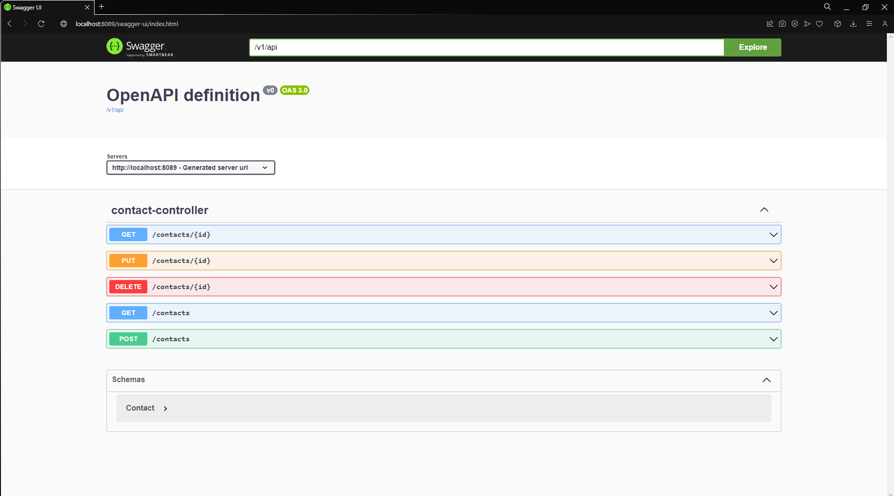

<h3 align="center">Practical Exercise</h3>

## About The Project
Spring Boot API project with integrated documentation

## Tools and technologies used
• Java 17 • Maven • Spring Boot 3 • Spring Web • SpringDoc OpenApi •

## Preview
- The documentation page brings together all APIs created in our contact controller, offering an interactive interface for developers to test each API.

  

